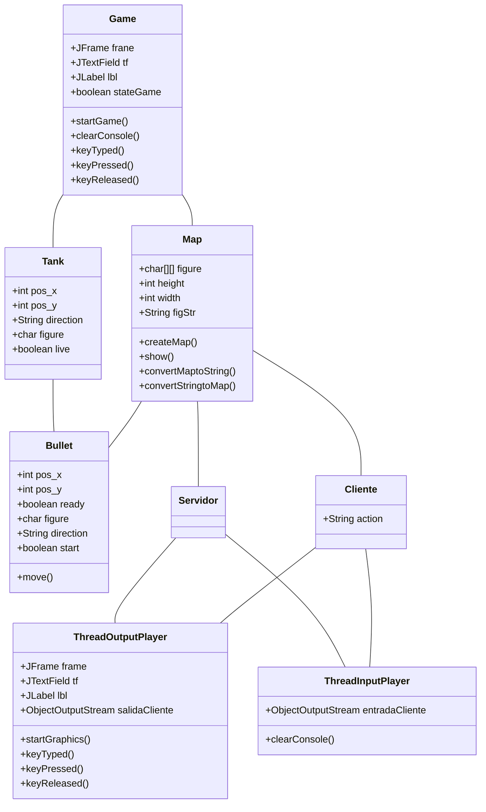

## BATTLE CITY

Estudiantes:

* Lázaro Camasca, Edson UNI-FC 
* Sarria Palacios, Eduardo UNI-FC
* Serrano Sánchez, Angela UNI-FC

Curso:

> CC462 - SISTEMAS CONCURRENTES Y DISTRIBUIDOS 2020-I

### Introducción

Los sistema multitask o multitarea ejecutan más de una tarea a la vez. Esto es cuando se cuenta con más de un procesador, de no ser este el caso, se alternan los procesos en un solo procesador. La ejecución de este proceso utiliza todo el procesador y su espacio de memoria asignado, en los sistemas multitarea que alternan procesos cuando un proceso libera el procesador, también se libera la memoria asignada a éste. De todo este proceso se encarga el **planificador** que agiliza la ejecución de los procesos y simula muchas veces la paralelización de estos. 

Una de las ventajas de la **programación multihilo** es poder priorizar ciertos procesos frente a otros y como se comportan estos, esto es usado en la programación de videojuegos priorizando la renderización de gráficos o en nuestro caso, un hilo por cliente. 

Este informe describe la replicación del juego Battle City con procesos multihilo para habilitar conexiones de tipo **cliente-servidor** y un topología de red tipo **estrella.**

### Marco teórico

##### Battle City

Es un videojuego de disparos multidireccionales con tanques producido y publicado por Namco como una adaptación de otro juego clásico Tank Battalion. 


El juego consiste en controlar un tanque sobre un escenario con otros tanques enemigos teniendo como objetivo evitar que destruyan la base militar, para hacer esto debe eliminar todos los tanque enemigos. Existen hasta ahora 35 niveles, el juego acaba si el enemigo destruye la base o el jugador gasta todas sus vidas.


##### Procesos e Hilos

En la programación concurrente, hay dos unidades básicas de ejecución: procesos e hilos. En el lenguaje de programación Java, la programación concurrente se ocupa principalmente de hilos. Sin embargo, los procesos también son importantes.

Un sistema usualmente tiene muchos procesos e hilos activos. Incluso cuando se tiene sólo un procesador, por lo tanto, solo tienen un hilo ejecutándose realmente en un momento dado. El tiempo de procesamiento para un solo núcleo se comparte entre procesos y subprocesos a través de una función del sistema operativo llamada **time slicing**

1. **Procesos**

   Un proceso tiene un entorno de ejecución autónomo. Un proceso generalmente tiene un conjunto privado completo de recursos básicos de tiempo de ejecución; en particular, cada proceso tiene su propio espacio de memoria.

   Los procesos a menudo se consideran sinónimos de programas o aplicaciones. Sin embargo, lo que el usuario ve como una sola aplicación puede, de hecho, ser un conjunto de procesos cooperantes. 

   La mayoría de las implementaciones de la máquina virtual Java se ejecutan como un solo proceso. Una aplicación Java puede crear procesos adicionales utilizando un objeto `ProcessBuilder`. 

2. **Hilos**

   Los hilos a veces se denominan *procesos ligeros*. Tanto los procesos como los hilos proporcionan un entorno de ejecución, pero la creación de un nuevo hilo requiere menos recursos que la creación de un nuevo proceso.

   Los hilos existen dentro de un proceso: cada proceso tiene al menos uno. Los hilos comparten los recursos del proceso, incluida la memoria y los archivos abiertos. Esto permite una comunicación eficiente, pero potencialmente problemática.

   La ejecución multihilo es una característica esencial de la plataforma Java. Cada aplicación tiene al menos un subproceso, o varios, si cuenta los subprocesos del "sistema" que hacen cosas como la gestión de la memoria y el manejo de la señal. Pero desde el punto de vista del programador de la aplicación, comienza con un solo hilo, llamado hilo principal.

##### Objetos `Thread`

Cada hilo es asociado a una instancia de la clase [`Thread`](https://docs.oracle.com/javase/8/docs/api/java/lang/Thread.html). Existen dos estrategias básicas con objetos`Thread` para crear una aplicación concurrente.

- Para controlar directamente la creación y manejo de hilos, se puede instanciar la clase `Thread` cada vez que la aplicación necesite iniciar una tarea asíncrona.
- Si se desea abstraer el manejo de hilos del resto de la apliación, las tareas deben ser pasadas a un  ejecutor principal.

##### Sockets

Normalmente, un servidor se ejecuta en una computadora específica y tiene un socket vinculado a un número de puerto específico. El servidor solo espera, escuchando el socket para que un cliente haga una solicitud de conexión.

**Por el lado del cliente**: el cliente conoce el nombre de host de la máquina en la que se ejecuta el servidor y el número de puerto en el que el servidor está escuchando. El cliente también necesita identificarse con el servidor para que se una a un número de puerto local que utilizará durante esta conexión. Esto generalmente lo asigna el sistema.


Si el servidor acepta la conexión, el servidor obtiene un nuevo socket vinculado al mismo puerto y un `endpoint` establecido en la dirección y puerto del cliente. Pero también es necesario obtener un nuevo socket de manera que libere el socket original y pueda escuchar otras solicitudes de conexión sin perder al cliente conectado.


Un **socket** se define como un `endpoint` de una comunicación bidireccional entre dos programas sobre la misma red. Este socket está vinculado a un número de puerto de manea que la capa TCP pueda identficar hacia donde se envía la data de la aplicación.

El paquete `java.net` en la plataforma Java proporciona una clase `Socket` que implementa un lado de una conexión bidireccional entre su programa Java y otro programa en la red. Al usar la clase `java.net.Socket` en lugar de depender del código nativo, sus programas Java pueden comunicarse a través de la red de manera independiente de la plataforma.

### Metodología

##### Limitaciones

Este laboratorio se basa en la modalidad del juego Battle City pero no adopta todas sus características:

* Sólo cuenta con un nivel
* No tiene interfaz gráfica, la visualización es por terminal de comandos.

##### Diagrama de clases



##### Eventos del teclado

Cada cliente para poder moverse debe presionar las teclas `U,D,L,R` para mover el tanque asignado.

```java
public void keyPressed(KeyEvent e) {
    int keyCode = e.getKeyCode();
    switch (keyCode) {
        case KeyEvent.VK_UP: action = "u"; break;
        case KeyEvent.VK_DOWN: action = "d"; break;
        case KeyEvent.VK_LEFT: action = "l"; break;
        case KeyEvent.VK_RIGHT: action = "r"; break;
        case KeyEvent.VK_A: action = "a"; break;
    }            
}
```

Y una vez para generar de nuevo el mapa, debemos limpiar la consola para recargar las figuras. La limitación es que este comando sólo corre para Windows.

```java
public void clearConsole() {
    try {
        new ProcessBuilder("cmd","/c","cls").inheritIO().start().waitFor();
    } catch (Exception e) {}    }
}
```

##### Servidor y jugadores

El servidor trata con los jugadores o clientes pero con un número límite de estos. Genera un tanque cada vez que se conecta un nuevo cliente y es aceptada la conexión de este. Con las clases estáticas `ThreadOutputPlayer` y `ThreadInputPlayer`  manejamos la comunicación de cada cliente.

```java
if(num_player < lim_num_players){
    servicio = servidor.accept();
    ti_player[num_player] = new ThreadInputPlayer(servicio, num_player);
    to_player[num_player] = new ThreadOutputPlayer(servicio, num_player);					
    players[num_player] = new Tank(map.width, map.height);
    player_lst.add(num_player);
    num_player++;
    System.out.print("\nWaiting for "+(lim_num_players-num_player)+" more players...");
}
```

La clase `Servidor` controla si un jugador fue eliminado averiguando la posición de los jugadores y cierra la conexión con ese jugador. De manera que cuando el número de clientes conectados (o jugadores sobrevivientes) sea igual a 1 sabe que ese es el ganador.

```java
while(true){
    for(int i=0; i<player_lst.size(); i++){
        if(map.figure[players[i].pos_y][players[i].pos_x] == '$'){
            ti_player[i].stop();
            to_player[i].stop();
            System.out.println("Jugador "+i+ " eliminado");
            player_lst.remove(i);
        }	
    }
    if(player_lst.size() == 1){
        System.out.println("Ganador: "+player_lst.get(0));
        System.out.println("Juego finalizado");
        break;
    }
}
```

##### Input/Output del servidor

Las clases `ThreadInputPlayer` y `ThreadOutputPlayer` controlan la interacción del cliente con el servidor interceptando la entrada y salida hacia cada agente. 

En el caso del **input** se captura la nueva posición del cliente y si éste envía un flag de haber disparado con la clase `Bullet` 

```java
entradaServidor = new ObjectInputStream(servicio.getInputStream());
while(true){	
    action = (String) entradaServidor.readObject();
    map = players[id].bullet.move(map);
    if(action.equals("0") == false){
        startAction(action, id);
    }
}
```

Dependiendo de las teclas que presione el cliente, el movimiento se calcula con le método `startAction`

```java
public static void startAction(String action, int id){
    if (action != ""){
        switch (action) {
            case "u": map = players[id].move("up", map); break;
            case "d": map = players[id].move("down", map); break;
            case "l": map = players[id].move("left", map); break;
            case "r": map = players[id].move("right", map); break;
            case "a": players[id].shoot(); break;
        }
}
```

Por otro lado, la clase `ThreadOutputPlayer` recarga el mapa, reescrbiendo la figura y limpiando la pantalla, con la nueva posición de los tanques

```java
salidaServidor = new ObjectOutputStream(servicio.getOutputStream());
while(true){
    map.convertMaptoString();
    salidaServidor.writeObject(map.figStr);
    TimeUnit.MILLISECONDS.sleep(300);				
}
```

##### Input/Output del cliente

De la misma manera del servidor, la clase `ThreadOutputPlayer` inicia el hilo del cliente, mostrando un mensaje de conexión y a la espera de otros clientes. Envía la acción que el cliente ejecuta y la envía al servidor.

```java
salidaCliente = new ObjectOutputStream(cliente.getOutputStream());
System.out.println("Client conected, waiting other players");
while(true){
    TimeUnit.MILLISECONDS.sleep(300);
    if (action.equals("0") == false){
        salidaCliente.writeObject(action);
        action ="0";
    }
} 
```

Entonces el `ThreadInputPlayer` lee el nuevo mapa enviado por el servidor para poder recargar los gráficos mostrados al cliente.

```java
entradaCliente = new ObjectInputStream(cliente.getInputStream());
System.out.println("Client conected, waitting other players");
while(true){	
    map.figStr = (String) entradaCliente.readObject();    
    map.convertStringtoMap();
    map.show();
    clearConsole();
}
```

##### Gráficos en consola

El mapa es almacenado en objetos `ObjectInputStream` y `ObjectOutputStream` de manera que son transferidos bidireccionalmente entre el servidor y el cliente. Los mapas creados, tienen las paredes dentro del escenario se dibujan con el símbolo `#` siendo limitado por paredes con símbolos `|`  por los costados, y los límites verticales por `-` quedando así:

```
-----------------------------------------------
|#####    ##############     ###     #########|
|#####    ##############     ###     #########|
|#####    ########           ###     #########|
|#####    ########     #########           ###|
|#####    		       #########           ###|
|#####    		       #########     #########|
|#        #####     ############     #########|
|#    #########     #########        #########|
|#    #########                  #############|
|#                               #############|
|#                  #########    #############|
|############################    #############|
-----------------------------------------------
```

Los principales personajes son los tanques, para minimizar la tasa de recarga de mapas, se decidió usar el símbolo `^` de manera que dependiendo de la posición en la que se encuentre el tanque, la punta será por donde se disparará la bala.

```
-----------------------------------------------
|#####    ##############     ###     #########|
|#####    ##############     ###     #########|
|#####    ########           ###     #########|
|#####    ########     #########           ###|
|#####    >		       #########           ###|
|#####    		       #########     #########|
|# v      #####     ############     #########|
|#    #########     #########        #########|
|#    #########                  #############|
|#                  <            #############|
|#                  #########    #############|
|############################    #############|
-----------------------------------------------
```

En a figura observamos 3 tanques, uno moviendose a la derecha, otroa hacia abajo y el último hacia la izquierda. Las balas tendrá forma de asterisco `*` quedando así el  mapa final.


### Resultados y Discusiones

Para la prueba del programa, se exportó un artefacto `.jar` que fue ejecutado por tres máquinas virtuales donde el servidor ejecutaba su respectiva clase `Servidor.class` y los otros dos `Cliente.class`

Se pudo observar al servidor a la espera de los clientes:


Luego de que el `jugador 0` se conectase, el servidor muestra:


Para el jugador conectado, se muestra:


Luego de que ambos clientes están conectados:


Y empieza el juego, mostrándose para ambas pantallas el mapa:


Aunque la tasa de recarga es rápida, como son máquinas virtuales no se puede apreciar bien la carga del mapa por algunos parpadeos de la consola.

Una vez empezado el juego, cuando uno de los clientes pierde, en este caso el `jugador 0` se muestra lo siguiente:

**En el servidor:**


**Jugador 0:**


**Jugador 1:**


### Conclusiones

Se observó que aunque se usó en el código los métodos `sleep()` para poder mejorar la tasa de recarga para los mapas en los clientes, la vista no fue la esperada. 

Como no se contaba con suficientes máquinas virtuales, no se pudo probar como continuaba el juego después de que el primer jugador fuese eliminado. Aún así, con la última imagen observamos que el mapa aún continúa disponible paa el jugador en pie por lo que podríamos suponer que si existiese más jugadores el juego continuaría de similar forma. 

También se observó una pantalla que sirve como detector de eventos del teclado, quizá un trabajo a futuro es poder ocultar esa ventana sin perder la funcionalidad.